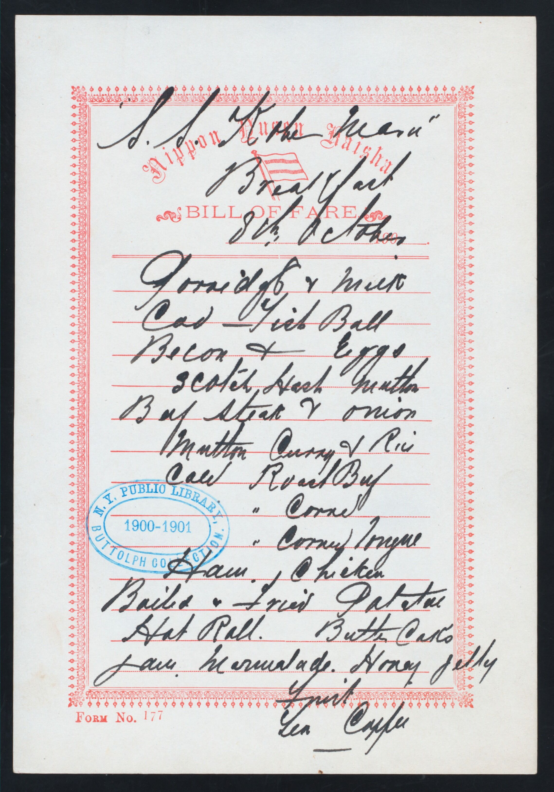
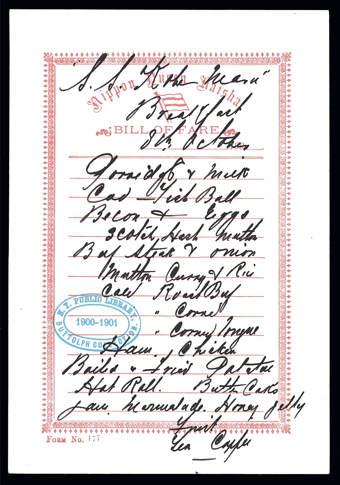
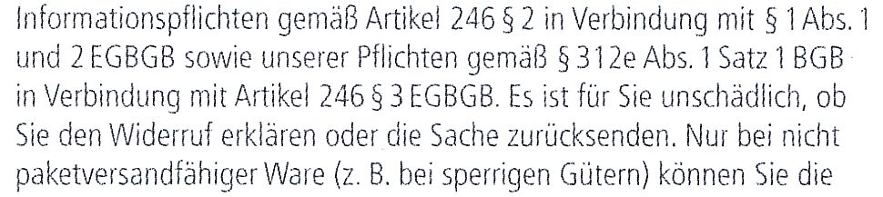
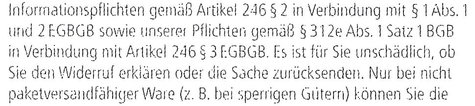
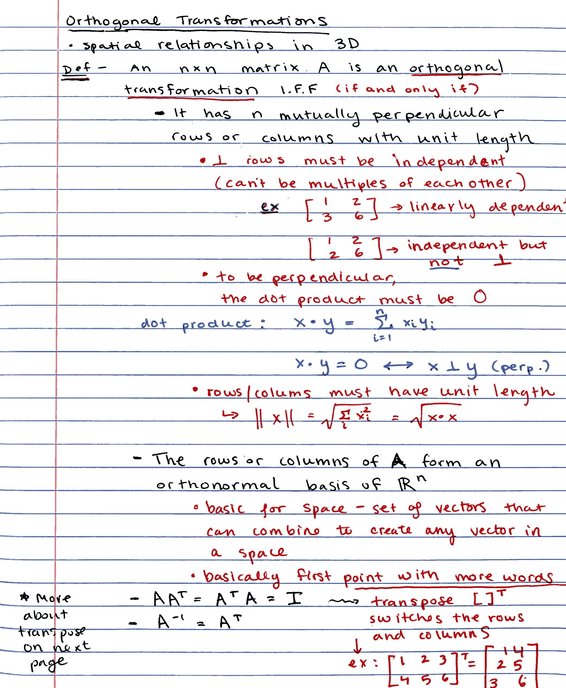

# noteshrunk - Document Color Palette Compression

This Python script compresses images by reducing the number of colors and optimizing the image representation.
It leverages KMeans clustering for color quantization and offers various options to customize the compression process.
All supplied images are then saved as a multi-page PDF.

The idea of the program is to optimize scanned documents.
This is a complete and improved rewrite of [mzucker's](https://github.com/mzucker/noteshrink) noteshrink.

## Features

* **Color Quantization:** Reduces the number of colors in the document using KMeans clustering, leading to smaller file sizes.
* **Background Detection and Removal:** Identifies and removes the background color.
* **Customizable Palette:** Allows you to specify the number of colors in the output palette and choose between a global palette for all pages or individual palettes for each page.
* **Color Control:** Offers the option to maximize saturation in the output image as well as to remove the background (replace with white), enhancing visual clarity.
* **Denoising Options:** Provides median filtering, morphological opening and unsharp masking to reduce noise and improve image quality.
* **Parallel processing:** Utilizes multiple CPU cores for faster processing of multiple images.

## Examples

### Generic Example

<table>
  <tr>
    <td width="50%"></td>
    <td width="50%"></td>
  </tr>
  <tr>
    <td>Original Image</td>
    <td><code>noteshrunk -w -s --unsharp_mask -ur 2 -ua 1</code></td>
  </tr>
</table>

Image Source: https://commons.wikimedia.org/wiki/File:BREAKFAST_(held_by)_NIPPON_YUSEN_KAISHA_-_S.S.KOBE_MARU_(at)_EN_ROUTE_(SS)_(NYPL_Hades-274833-469108).jpg

### Fine / Low Resolution Text

Morphological Opening swallows fine structures, but unsharp masking helps preserve them.

<table>
  <tr>
    <td></td>
  </tr>
  <tr>
    <td><code>Original Image (own)</code></td>
  </tr>
  <tr>
    <td></td>
  </tr>
  <tr>
    <td><code>noteshrunk -w --denoise_opening -os .9</code></td>
  </tr>
  <tr>
    <td></td>
  </tr>
  <tr>
    <td><code>noteshrunk -w --unsharp_mask </code></td>
  </tr>
</table>

### Advanced Example

<table>
  <tr>
    <td width="50%"></td>
    <td width="50%"></td>
  </tr>
  <tr>
    <td>Original Image</td>
    <td><code>noteshrunk -w -s -tv 30 --denoise_opening -os 1.6 -n 6 -p 100 example_3-orig.jpg</code></td>
  </tr>
</table>

Image Source: https://github.com/mzucker/noteshrink/blob/master/examples/notesA1.jpg

### Further Examples

1.  Compress a single image with default settings:

    ```bash
    noteshrunk input.png
    ```

2.  Compress multiple images with a white background and 16 colors:

    ```bash
    noteshrunk -w -n 16 image1.jpg image2.png
    ```

3.  Compress images using a local color palette and keep intermediate files while disabling multi-threading:
    ```bash
    noteshrunk -l -j 1 -k *.jpg
    ```

## Requirements

### Python Packages

- argcomplete
- NumPy
- Pillow (PIL Fork)
- Python 3
- scikit-image
- scikit-learn
- SciPy

### Other

- Ghostscript (executable `gs` in PATH - for PDF merging)

## Installation

```bash
pipx install noteshrunk
```

## Usage

```
noteshrunk [-h] [-o OUTPUT] [-w] [-s] [-n N_COLORS] [-d DPI] [-q [1-100]] [-l]
           [-p PERCENTAGE] [-j JOBS] [-y]
           [-ts THRESHOLD_SATURATION] [-tv THRESHOLD_VALUE]
           [--denoise_median] [--denoise_opening] [--unsharp_mask]
           [-ms MEDIAN_STRENGTH] [-cs CLOSING_STRENGTH] [-ua UNSHARP_AMOUNT] [-ur UNSHARP_RADIUS]
           [-k] [-v] [--version] files [files ...]
```

### Arguments

* `files`: A list of paths to the input image files.
* `-o`, `--output`: Path to the output PDF file (default: `output.pdf`).
* `-w`, `--white_background`: Use white background instead of dominant color.
* `-s`, `--saturate`: Maximize saturation in the output image.
* `-n`, `--n_colors`: Number of colors in the palette (default: 8).
* `-d`, `--dpi`: DPI value of the input images (default: 300).
* `-q`, `--quality`: JPEG quality of the images embedded in the PDF (1-100, default: 75).
* `-l`, `--local_palette`: Create an individual color palette for each image (by sampling a -p percentage of the pixels of that image) instead of a global palette (by sampling a -p percentage of the pixels of each input image).
* `-p`, `--percentage`: Percentage of pixels to sample from each input image for color palette creation (default: 10).
* `-j`, `--jobs`: Number of threads to use for multi-threading (default: number of CPU cores).
* `-y`, `--overwrite`: Overwrite existing files without asking.
* `-ts`, `--threshold_saturation`: HSV saturation threshold (in percent) used for background detection (default: 15).
* `-tv`, `--threshold_value`: HSV value threshold (in percent) used for background detection (default: 25).
* `--denoise_median`: Apply median denoising on the output image with strength `-ms`.
* `-ms`, `--median_strength`: Strength of median filtering (default: 3).
* `--denoise_opening`: Apply morphological opening on the background mask with strength `-os`.
* `-os`, `--opening_strength`: Strength of opening filtering / radius of the structuring element (disk, default: 3).
* `--unsharp_mask`: Apply unsharp masking on the final image with radius `-ur` and amount `-ua`.
* `-ur`, `-ua`: Radius and Amount used for unsharp masking.
* `-k`, `--keep_intermediate`: Keep the intermediate single-page PDFs.
* `-v`, `--verbose`: Verbose output.
* `--version`: Show program version and exit.

## Contributing

Contributions are welcome! Please feel free to submit issues or pull requests on the GitHub repository.

## Acknowledgements

This project utilizes open-source software from the Python community.
Special thanks to the developers and maintainers of the required libraries as well as [mzucker's](https://github.com/mzucker/noteshrink) initial program.

## License

This project is licensed under the MIT License. See the `LICENSE` file for details.
